# Evaluating effectiveness of controlling little seed canary grass by using chemical herbicides and allelopathic synthetic community

**Note by gaoch**:

-   Knit this document to see the results.
-   Project files are now be organized as a Git repository. The remote
    server address is located at
    <https://gitee.com/soilmicro/weed-suppression>. If you know Git, you
    may clone it from that remote repository after joining in the
    soilmicro organization/company.

From:

> Integrated application of synthetic community reduces consumption of
> herbicide in field weed control, by Amina Hadayat, Zahir Ahmad Zahir,
> Peng Cai, Chun-Hui Gao, submitted

# Load packages

``` r
library(tidyverse)
library(cowplot)
library(ggpubr)
library(pheatmap)
library(RColorBrewer)
library(vegan)
library(reshape2)
library(magrittr)
library(ggplot2)

theme_set(theme_bw())
```

To enable reproducible study, we provided the raw-data and source codes
for analysis and generating figures.

# Data processsing

Raw data were stored in the `data` folder. It mainly comes from two
experiments: one from growth room study, and the other is field
experiment. The raw data is provided as in formatted form.

``` r
weed_suppression <- read_csv("data/weed suppression.csv")
wheat_promotion <- read_csv("data/wheat promotion.csv")
weed_infestation <- read_csv("data/weed infestation.csv")
infested_wheat <- read_csv("data/infested wheat.csv")
head(weed_suppression) # suppress weed growth by herbicide and SynComs
#> # A tibble: 6 × 11
#>   herbicide_dose    Inoculation seed_germination SPAD_value plant_height
#>   <chr>             <chr>                  <dbl>      <dbl>        <dbl>
#> 1 Herbicide control Control                 86.7        3.9         14  
#> 2 Herbicide control Control                 93.3        3.5         18  
#> 3 Herbicide control Control                100          3.6         16  
#> 4 Atlantis 25%      Control                 80          2.5         15.5
#> 5 Atlantis 25%      Control                 86.7        2.8         16  
#> 6 Atlantis 25%      Control                 73.3        2.7         17  
#> # ℹ 6 more variables: root_length <dbl>, fresh_biomass <dbl>, protein <dbl>,
#> #   chlorophyll_a <dbl>, chlorophyll_b <dbl>, caroteniod <dbl>
head(wheat_promotion) # SynComs promote wheat growth 
#> # A tibble: 6 × 10
#>   Inoculations seed_germination plant_height Root_length fresh_biomass
#>   <chr>                   <dbl>        <dbl>       <dbl>         <dbl>
#> 1 control                  33.3           29        10            1.25
#> 2 control                  50             27        11            1.25
#> 3 control                  33.3           28         8            1.22
#> 4 C1                       50             30        11.5          1.52
#> 5 C1                       50             32        10            1.54
#> 6 C1                       66.7           31        12            1.5 
#> # ℹ 5 more variables: SPAD_value <dbl>, chlorophyll_a <dbl>,
#> #   chlorophyll_b <dbl>, carotenoid <dbl>, protein <dbl>
head(weed_infestation) # field trail of weed suppression
#> # A tibble: 6 × 10
#>   treatments       total_weed_density no_of_native_weeds shoot_length SPAD_value
#>   <chr>                         <dbl>              <dbl>        <dbl>      <dbl>
#> 1 weedy control                   117               89.7          109       49.4
#> 2 weedy control                   137               81.8          120       45.8
#> 3 weedy control                   135               76.9          107       42.6
#> 4 wheat+weed 100%…                 38               42.1           98       47.3
#> 5 wheat+weed 100%…                 37               39.5          103       41.2
#> 6 wheat+weed 100%…                 34               38.2          102       39.2
#> # ℹ 5 more variables: grain_yield <dbl>, straw_yield <dbl>,
#> #   photosynthetic_rate <dbl>, transpiration_rate <dbl>,
#> #   stomatal_conductance <dbl>
head(infested_wheat) # field trail of wheat promotion
#> # A tibble: 6 × 10
#>   treatments     shoot_length SPAD_value no_of_tillers_per_pl…¹ biological_yield
#>   <chr>                 <dbl>      <dbl>                  <dbl>            <dbl>
#> 1 weed free con…          110       48.2                     14             9.95
#> 2 weed free con…          115       43.7                     13            10.0 
#> 3 weed free con…          126       43.7                     12            10.2 
#> 4 wheat+weed 10…          100       38.4                     11             8.23
#> 5 wheat+weed 10…           96       40.2                     10             8.12
#> 6 wheat+weed 10…           94       39.2                     11             8.16
#> # ℹ abbreviated name: ¹​no_of_tillers_per_plant
#> # ℹ 5 more variables: grain_yield <dbl>, straw_yield <dbl>,
#> #   photosynthetic_rate <dbl>, transpiration_rate <dbl>,
#> #   stomatal_conductance <dbl>
```

The columns are:

-   `herbicide_dose`: herbicide_doses, indicating the name of two
    different chemical herbicides (Atlantis and Axial) at 25 and 50% of
    recommended doses: i.e. “Herbicide control”, “Atlantis 25%”,
    “Atlantis 50%”, “Axial 25%”, “Axial 50%”.

-   `Inoculation`: Inoculation indicating the combinations of four
    different Pseudomonas strains (B11, T19, T24, T75) collected from
    Soil microbiology biochemistry laboratory, University of Agriculture
    Faisalabad. “C1”, “C2”, “C3”, “C4” represent the Pseudomonas strain
    combinations such as C1 (B11 x T75), C2 (T19 x T24), C3 (B11 x T24 x
    T75) and C4 (B11 x T19 x T24 x T75).

-   `treatments`: Under field condition nine treatments were planned in
    block plot for both weed infestation and infested wheat with weedy
    and wheat free control respectively, in order to evaluate the
    selected C4 combination along with Axial herbicide at four different
    recommended doses such as: 25, 50, 75, and 100% Axial with
    respective control treatments.

# Distribution of values

`weed_suppression` indicates the effect of SynComs and herbicides on the
growth and physiology of *P. minor* under axenic condition. Nine
parameters were obtained.

``` r
par(mfrow=c(3,3))

hist(weed_suppression$seed_germination, main = "Seed germination")
hist(weed_suppression$SPAD_value, main = "SPAD value")
hist(weed_suppression$plant_height, main = "Plant height")
hist(weed_suppression$root_length, main = "Root length")
hist(weed_suppression$fresh_biomass, main = "Fresh biomass")
hist(weed_suppression$protein, main = "Protein")
hist(weed_suppression$chlorophyll_a, main = "Chlorophyll A")
hist(weed_suppression$chlorophyll_b, main = "Chlorophyll B")
hist(weed_suppression$caroteniod, main = "Caroteniod")
```

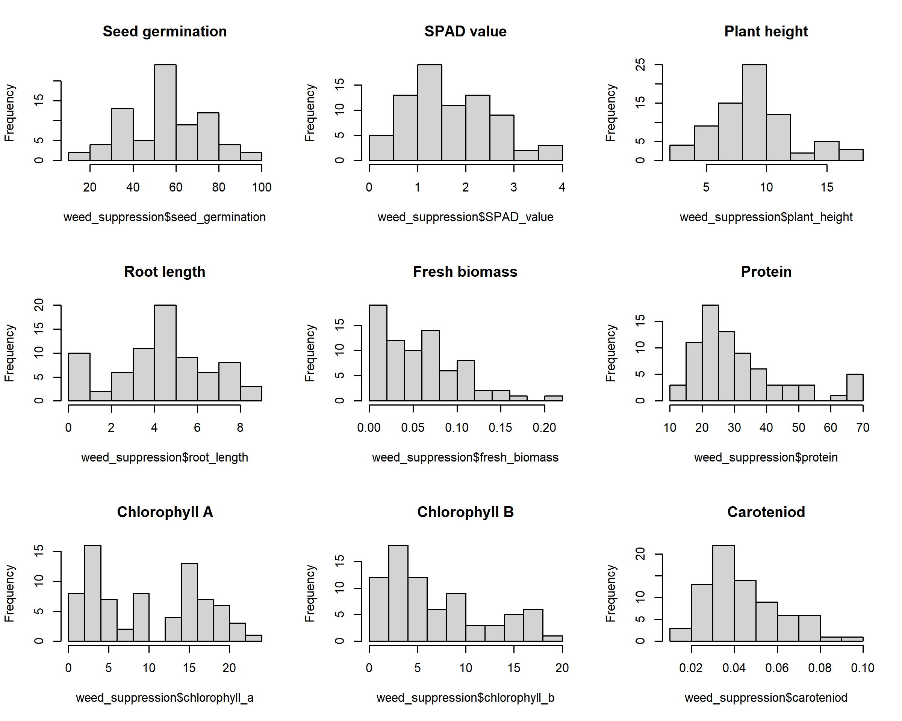

# A new graph

Disign a graph to show the results more clearly. This plot has three
parts.

1.  boxplot shows the value of data, and statistical results of
    comparision;
2.  a dotplot shows the dose of herbicide;
3.  another dotplot shows the applying inoculation.

-   **seed germination rate of weed**

The less of seed germination rate of weed, the better of the suppression
of a recipe.

``` r
df = weed_suppression %>% 
  mutate(herbicide_dose = fct_rev(as_factor(herbicide_dose)),
         Inoculation = fct_rev(as_factor(Inoculation))) %>% 
  group_by(herbicide_dose, Inoculation) %>% 
  mutate(group = factor(cur_group_id()), .before = 3)

df$group = fct_reorder(df$group, df$seed_germination)
 symnum.args<-list(cutpoints= c(0, 0.01, 0.05, Inf),
                            symbols = c("**","*","ns"))

# find the group id by groups
groups = distinct(df, herbicide_dose, Inoculation, group) %>% 
  filter(herbicide_dose == "Herbicide control", Inoculation == "Control") 
ref_group = groups$group %>% as.character()

# boxplot
p1 = df %>% 
  ggplot(aes(group, seed_germination)) +
  geom_boxplot(outlier.shape = NA) +
  stat_compare_means(ref.group = ref_group,
                     method = "t.test",
                     hide.ns = FALSE,
                     label = "p.signif",
                     symnum.args = symnum.args) +
  # geom_jitter(width = 0.01) +
  theme(axis.title.x = element_blank(),
        axis.text.x = element_blank(),
        axis.ticks.x = element_blank())

# the herbicide dose
p2 = df %>% 
  ggplot(aes(group, herbicide_dose)) +
  geom_point(size = 3, shape = 15) +
  theme(axis.title.x = element_blank(),
        axis.text.x = element_blank(),
        axis.ticks.x = element_blank(),
        plot.margin = margin(t = 0, r = 0, b = 0, l = 0, unit = "pt"))

# the inoculation
p3 = df %>% 
  ggplot(aes(group, Inoculation)) +
  geom_point(size = 3, shape = 15) +
  theme(axis.text.x = element_blank(),
        axis.ticks.x = element_blank(),
        plot.margin = margin(t = 0, r = 0, b = 0, l = 0, unit = "pt"))
aplot::plot_list(p1,p2,p3, ncol = 1, heights = c(1,.2,.2))
```

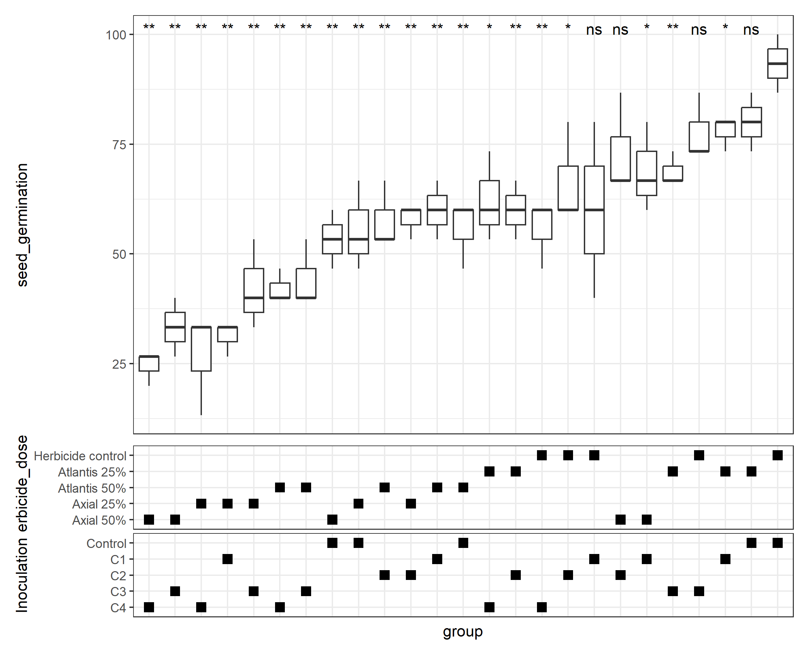

Control is located on the most right side, so that all the combinations
of herbicide and SynComs have better effect in suppressing weed seed
germination. Among them, who have the best performance are Axial 25%-50%
plus C1/C3/C4.

Now, every parameter can generate a similar plot.

``` r
# reuse code with a function
plot_recipe_effect = function(df, value){
  df$group = fct_reorder(df$group, df[[value]])

# symnum.args
symnum.args<-list(cutpoints= c(0, 0.01, 0.05, Inf),
                            symbols = c("**","*","ns"))

  # find the group id by groups
  groups = distinct(df, herbicide_dose, Inoculation, group) %>% 
    filter(herbicide_dose == "Herbicide control", Inoculation == "Control") 
  ref_group = groups$group %>% as.character()
  
  p1 = df %>% 
    ggplot(aes_string("group", value)) +
    geom_boxplot(outlier.shape = NA) +
    stat_compare_means(ref.group = ref_group,
                       method = "t.test",
                       hide.ns = FALSE,
                       label = "p.signif",
                       symnum.args = symnum.args) +
    # geom_jitter(width = 0.01) +
    theme(axis.title.x = element_blank(),
          axis.text.x = element_blank(),
          axis.ticks.x = element_blank())
  
  p2 = df %>% 
    ggplot(aes(group, herbicide_dose)) +
    geom_point(size = 3, shape = 15) +
    theme(axis.title.x = element_blank(),
          axis.text.x = element_blank(),
          axis.ticks.x = element_blank(),
          plot.margin = margin(t = 0, r = 0, b = 0, l = 0, unit = "pt"))
  p3 = df %>% 
    ggplot(aes(group, Inoculation)) +
    geom_point(size = 3, shape = 15) +
    theme(axis.text.x = element_blank(),
          axis.ticks.x = element_blank(),
          plot.margin = margin(t = 0, r = 0, b = 0, l = 0, unit = "pt"))

  # combined graph
  aplot::plot_list(p1,p2,p3, ncol = 1, heights = c(1,.2,.2))
}
```

# Weed control by using the combination of herbicides and synthetic community

Firstly, we investigated the influence of AB combinations and chemical
herbicides on *P. minor* growth and phenological parameter reduction.
The experiments were carried out in green house, and only weed were
planted.

## Weed growth

### Seed germination

``` r
plot_recipe_effect(df, value = "seed_germination")
#> Warning: `aes_string()` was deprecated in ggplot2 3.0.0.
#> ℹ Please use tidy evaluation idioms with `aes()`.
#> ℹ See also `vignette("ggplot2-in-packages")` for more information.
#> This warning is displayed once every 8 hours.
#> Call `lifecycle::last_lifecycle_warnings()` to see where this warning was
#> generated.
```


### Plant height

``` r
plot_recipe_effect(df, value = "plant_height")
```

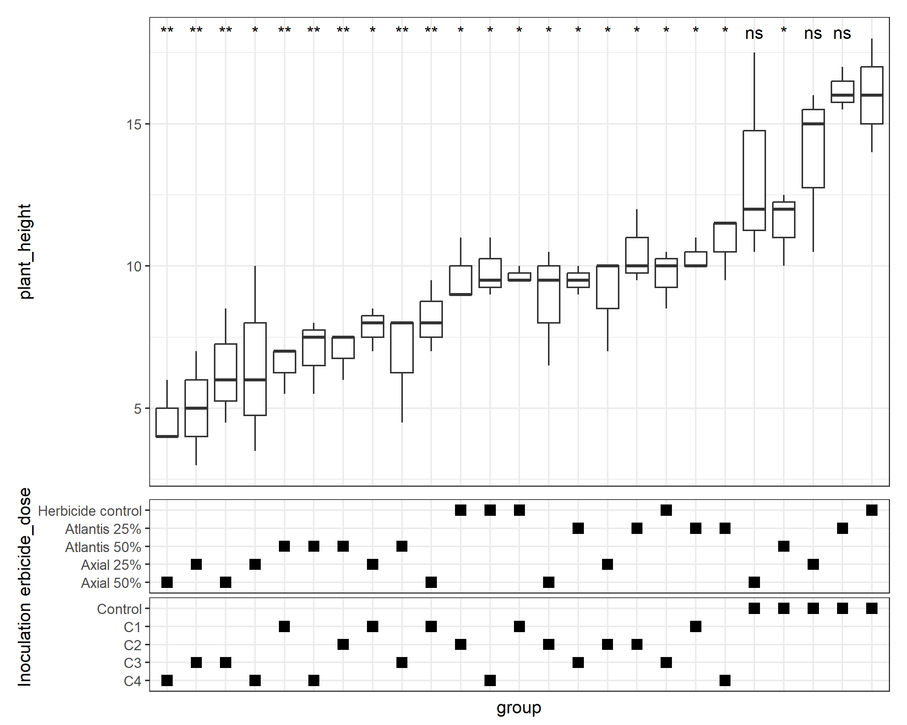

### Root length

``` r
plot_recipe_effect(df, value = "root_length")
```

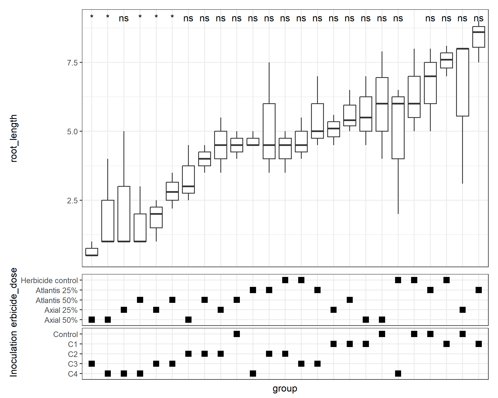

### Fresh biomass

``` r
plot_recipe_effect(df, value = "fresh_biomass")
```

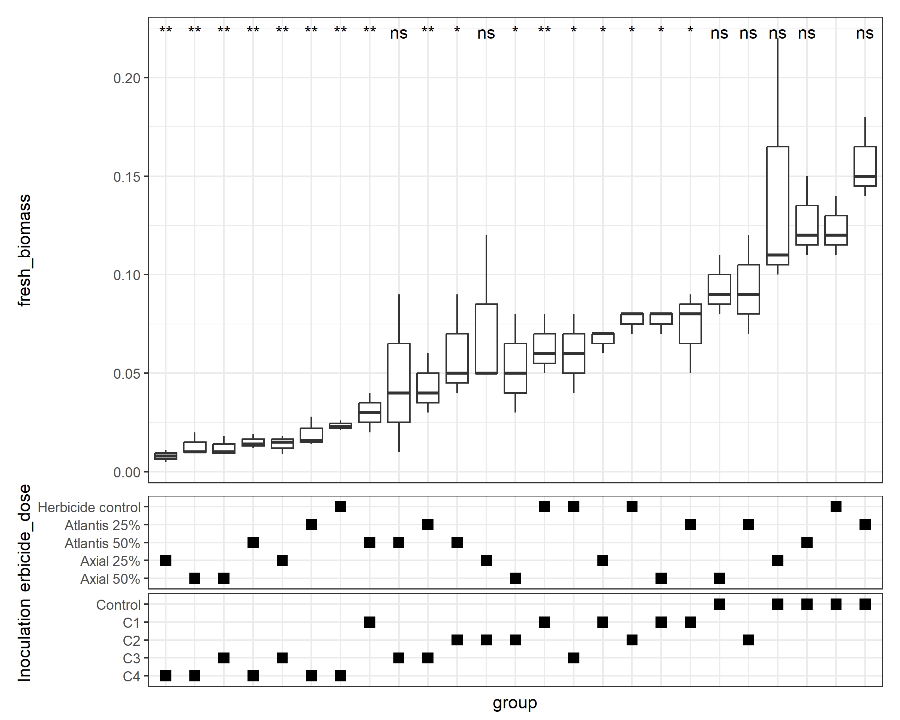

### Protein content

``` r
plot_recipe_effect(df, value = "protein")
```

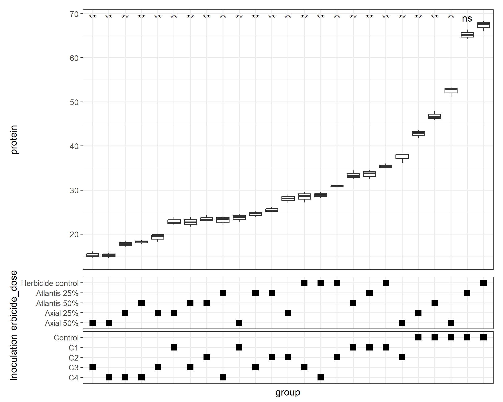

## Weed pigments

Plants contain several different pigments, including chlorophylls,
carotenoids, and flavonoids. Chlorophylls are the primary pigments
responsible for the green color of plants and are essential for
photosynthesis. Carotenoids, which include beta-carotene, lycopene,
lutein, and zeaxanthin, are responsible for the yellow, orange, and red
colors of many fruits and vegetables, and also serve as antioxidants.
Flavonoids, which include anthocyanins, flavonols, and flavones, are
responsible for the red, blue, and purple colors of many fruits and
flowers, and also play a role in plant defense against environmental
stresses.

### SPAD value of weed

SPAD value is a measure provided by the SPAD-502Plus, which is a
portable, non-destructive measuring device for the chlorophyll content
of leaves.


<p class="caption">
Product of SPAD-502+
</p>

``` r
plot_recipe_effect(df, value = "SPAD_value")
```

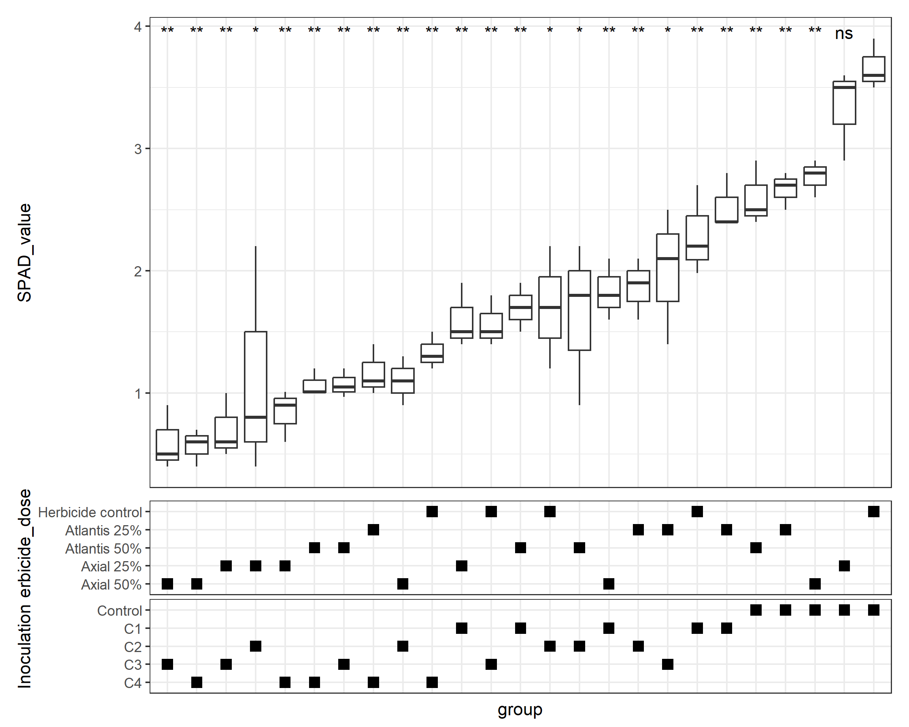

### Chlorophyll A

There are several types of chlorophyll, including chlorophyll a,
chlorophyll b, chlorophyll c, chlorophyll d, and chlorophyll e, each
with their own unique molecular structure and light absorption
properties. Chlorophyll is responsible for giving plants their green
color, and it is also used as a natural food coloring agent and in some
medicinal and industrial applications.

Chlorophyll a is the primary pigment involved in photosynthesis and is
found in all photosynthetic organisms, including plants, algae, and
cyanobacteria. It absorbs light most efficiently at wavelengths of
430-660 nm (blue and red light), and it plays a critical role in the
initial stages of photosynthesis by absorbing light and passing on the
energy to other molecules.

``` r
plot_recipe_effect(df, value = "chlorophyll_a")
```

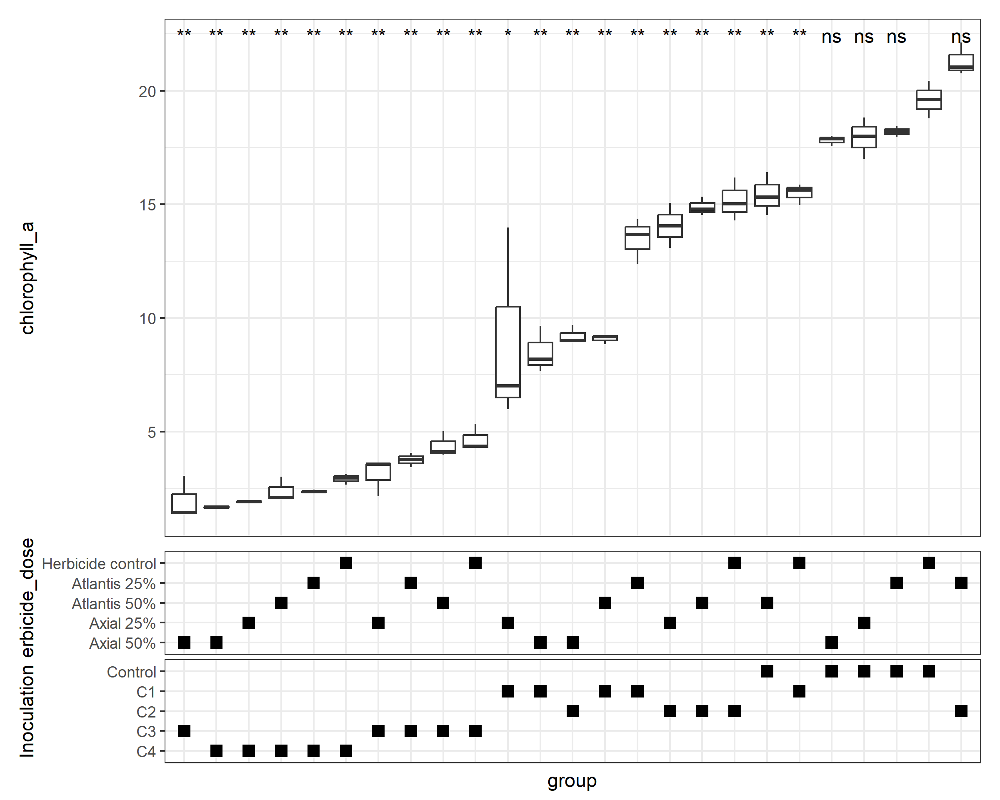

### Chlorophll B

Chlorophyll b, on the other hand, is an accessory pigment that is found
only in higher plants and green algae. It absorbs light most efficiently
at wavelengths of 450-650 nm (blue and orange light) and transfers this
energy to chlorophyll a. Chlorophyll b also helps to broaden the
spectrum of light that can be absorbed by the plant, allowing it to
capture more energy from the sun and carry out photosynthesis more
efficiently.

``` r
plot_recipe_effect(df, value = "chlorophyll_b")
```

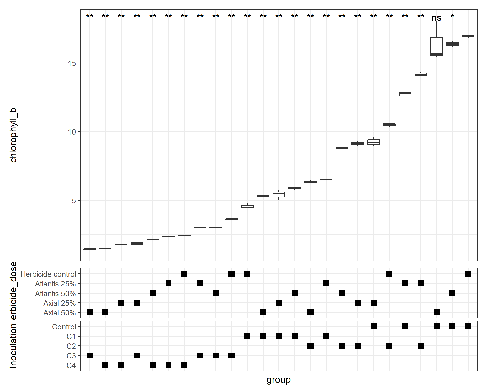

### Caroteniod

Carotenoids are a group of natural pigments that are found in many
plants, algae, and some bacteria. They are responsible for the yellow,
orange, and red colors of many fruits and vegetables, as well as the
bright colors of many flowers. Carotenoids are important antioxidants
that help protect plants and other organisms from damage caused by
harmful molecules known as free radicals. In addition to their role in
providing color to plants and other organisms, carotenoids also have
important health benefits for humans, including promoting eye health,
supporting the immune system, and reducing the risk of certain chronic
diseases. Some common carotenoids include beta-carotene, lycopene,
lutein, and zeaxanthin.

``` r
plot_recipe_effect(df, value = "caroteniod")
```

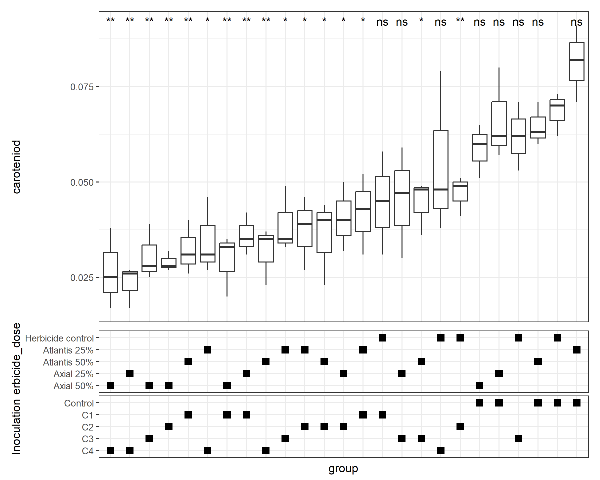

# Wheat growth promotion by SynComs

``` r
wheat_promotion
#> # A tibble: 15 × 10
#>    Inoculations seed_germination plant_height Root_length fresh_biomass
#>    <chr>                   <dbl>        <dbl>       <dbl>         <dbl>
#>  1 control                  33.3         29          10            1.25
#>  2 control                  50           27          11            1.25
#>  3 control                  33.3         28           8            1.22
#>  4 C1                       50           30          11.5          1.52
#>  5 C1                       50           32          10            1.54
#>  6 C1                       66.7         31          12            1.5 
#>  7 C2                       50           28           9            1.23
#>  8 C2                       66.7         29          12            1.22
#>  9 C2                       66.7         26          11            1.24
#> 10 C3                       50           31          13            1.44
#> 11 C3                       83.3         35          15            1.42
#> 12 C3                       66.7         32          12.5          1.41
#> 13 C4                       66.7         34          15.5          1.6 
#> 14 C4                       83.3         35.5        14            1.59
#> 15 C4                       66.7         36          15.5          1.58
#> # ℹ 5 more variables: SPAD_value <dbl>, chlorophyll_a <dbl>,
#> #   chlorophyll_b <dbl>, carotenoid <dbl>, protein <dbl>
```

## ANOVA analysis

``` r
compare_means(seed_germination~Inoculations,data = wheat_promotion,ref.group="control",
              method = "t.test")
#> # A tibble: 4 × 8
#>   .y.              group1  group2      p p.adj p.format p.signif method
#>   <chr>            <chr>   <chr>   <dbl> <dbl> <chr>    <chr>    <chr> 
#> 1 seed_germination control C1     0.101  0.16  0.101    ns       T-test
#> 2 seed_germination control C2     0.0474 0.14  0.047    *        T-test
#> 3 seed_germination control C3     0.0824 0.16  0.082    ns       T-test
#> 4 seed_germination control C4     0.0132 0.053 0.013    *        T-test

compare_means(plant_height~Inoculations,data = wheat_promotion,method = "anova")
#> # A tibble: 1 × 6
#>   .y.                 p   p.adj p.format p.signif method
#>   <chr>           <dbl>   <dbl> <chr>    <chr>    <chr> 
#> 1 plant_height 0.000277 0.00028 0.00028  ***      Anova

compare_means(Root_length~Inoculations,data = wheat_promotion,ref.group="control",
              method = "t.test")
#> # A tibble: 4 × 8
#>   .y.         group1  group2      p p.adj p.format p.signif method
#>   <chr>       <chr>   <chr>   <dbl> <dbl> <chr>    <chr>    <chr> 
#> 1 Root_length control C1     0.242  0.48  0.242    ns       T-test
#> 2 Root_length control C2     0.468  0.48  0.468    ns       T-test
#> 3 Root_length control C3     0.0313 0.094 0.031    *        T-test
#> 4 Root_length control C4     0.0117 0.047 0.012    *        T-test

compare_means(fresh_biomass~Inoculations,data = wheat_promotion,method = "anova")
#> # A tibble: 1 × 6
#>   .y.                  p         p.adj p.format p.signif method
#>   <chr>            <dbl>         <dbl> <chr>    <chr>    <chr> 
#> 1 fresh_biomass 1.08e-10 0.00000000011 1.1e-10  ****     Anova

compare_means(SPAD_value~Inoculations,data = wheat_promotion,ref.group="control",
              method = "t.test")
#> # A tibble: 4 × 8
#>   .y.        group1  group2       p p.adj p.format p.signif method
#>   <chr>      <chr>   <chr>    <dbl> <dbl> <chr>    <chr>    <chr> 
#> 1 SPAD_value control C1     0.431   0.43  0.4313   ns       T-test
#> 2 SPAD_value control C2     0.00915 0.027 0.0091   **       T-test
#> 3 SPAD_value control C3     0.0240  0.048 0.0240   *        T-test
#> 4 SPAD_value control C4     0.00319 0.013 0.0032   **       T-test

compare_means(chlorophyll_a~Inoculations,data = wheat_promotion,ref.group="control",
              method = "t.test")
#> # A tibble: 4 × 8
#>   .y.           group1  group2       p p.adj p.format p.signif method
#>   <chr>         <chr>   <chr>    <dbl> <dbl> <chr>    <chr>    <chr> 
#> 1 chlorophyll_a control C1     0.00353 0.014 0.0035   **       T-test
#> 2 chlorophyll_a control C2     0.128   0.26  0.1280   ns       T-test
#> 3 chlorophyll_a control C3     0.610   0.61  0.6104   ns       T-test
#> 4 chlorophyll_a control C4     0.0110  0.033 0.0110   *        T-test

compare_means(chlorophyll_b~Inoculations,data = wheat_promotion,ref.group="control",
              method = "t.test")
#> # A tibble: 4 × 8
#>   .y.           group1  group2       p p.adj p.format p.signif method
#>   <chr>         <chr>   <chr>    <dbl> <dbl> <chr>    <chr>    <chr> 
#> 1 chlorophyll_b control C1     0.0184  0.032 0.0184   *        T-test
#> 2 chlorophyll_b control C2     0.00494 0.019 0.0049   **       T-test
#> 3 chlorophyll_b control C3     0.0162  0.032 0.0162   *        T-test
#> 4 chlorophyll_b control C4     0.00483 0.019 0.0048   **       T-test

compare_means(carotenoid~Inoculations,data = wheat_promotion,ref.group="control",
              method = "t.test")
#> # A tibble: 4 × 8
#>   .y.        group1  group2      p p.adj p.format p.signif method
#>   <chr>      <chr>   <chr>   <dbl> <dbl> <chr>    <chr>    <chr> 
#> 1 carotenoid control C1     0.0486 0.097 0.049    *        T-test
#> 2 carotenoid control C2     0.303  0.3   0.303    ns       T-test
#> 3 carotenoid control C3     0.0324 0.097 0.032    *        T-test
#> 4 carotenoid control C4     0.0187 0.075 0.019    *        T-test

compare_means(protein~Inoculations,data = wheat_promotion,ref.group="control",
              method = "t.test")
#> # A tibble: 4 × 8
#>   .y.     group1  group2        p  p.adj p.format p.signif method
#>   <chr>   <chr>   <chr>     <dbl>  <dbl> <chr>    <chr>    <chr> 
#> 1 protein control C1     0.000661 0.0026 0.00066  ***      T-test
#> 2 protein control C2     0.356    0.36   0.35581  ns       T-test
#> 3 protein control C3     0.00480  0.0096 0.00480  **       T-test
#> 4 protein control C4     0.00185  0.0056 0.00185  **       T-test
```

Whether strains combinations have ability to enhance the growth of wheat
or not.

``` r
cols <- setdiff(names(wheat_promotion), 'Inoculations')
y_labels <- c("seed germination (%)","plant height (cm)", "root length (cm)","fresh biomass (g)","SPAD value","chlorophyll a (ppm)","chlorophyll b (ppm)","carotenoid (ppm)","protein (ppm)")

#symnum.args to adjust p-value
symnum.args<-list(cutpoints= c(0, 0.01, 0.05, Inf),
                            symbols = c("**","*","ns"))
list_plots = Map(function(x, y) {
  ggboxplot(data = wheat_promotion, x = "Inoculations", y = x,
            ylab = y, xlab = "Inoculations",
            add = "jitter")+
    stat_compare_means(label = "p.signif", 
                       method = "t.test",
                     ref.group = "control",
                     symnum.args = symnum.args)+
    rotate_x_text(angle = 40)+
    labs(x="") +
    theme(legend.position = "right",
          legend.title = element_text(color="black",size = 10,
                                      face = "bold"),
          legend.text = element_text(color = "black",size = 8),
          plot.margin = margin(t = 2, r = 0, b = 0, l = 2, unit = "pt")) +
    scale_y_continuous(expand = expansion(0.2))
    
}, cols, y_labels)

cowplot::plot_grid(plotlist = list_plots[1:3],
                   labels = "AUTO",
                   ncol = 2)
```

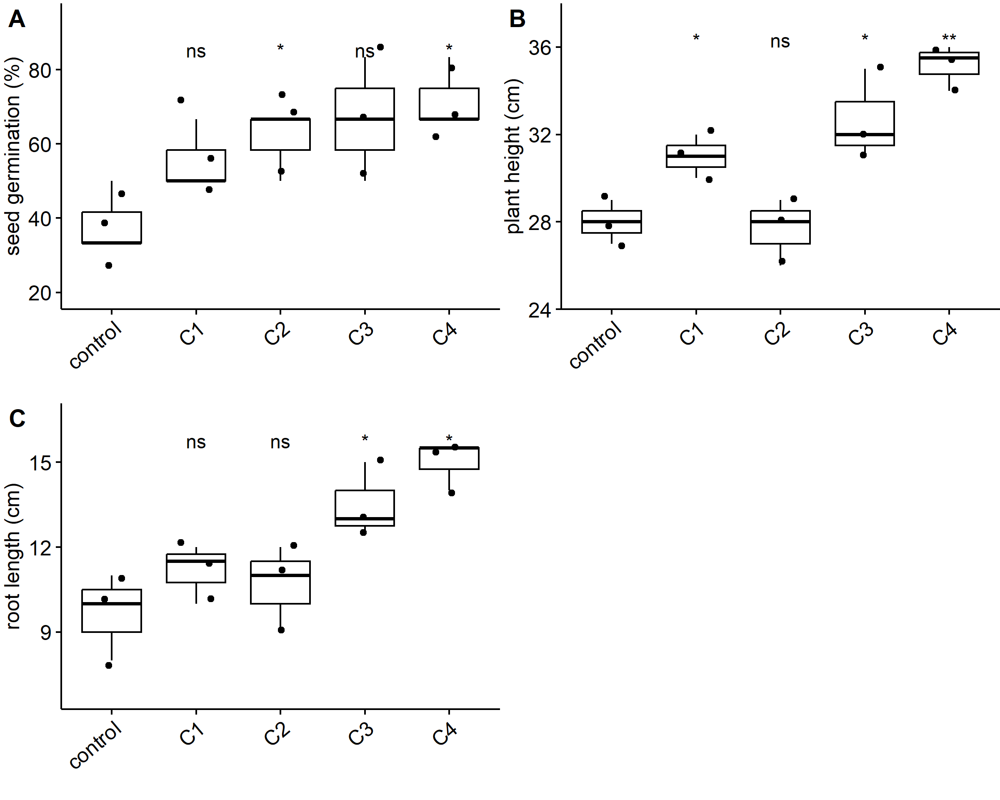

C4 has the best performance in increasing seed germination, plant
height, root length and fresh biomass of wheat, followed by C3 or C1.

``` r

cowplot::plot_grid(plotlist = list_plots[6:9],
                    labels = "AUTO",
                   align = "hv")
```

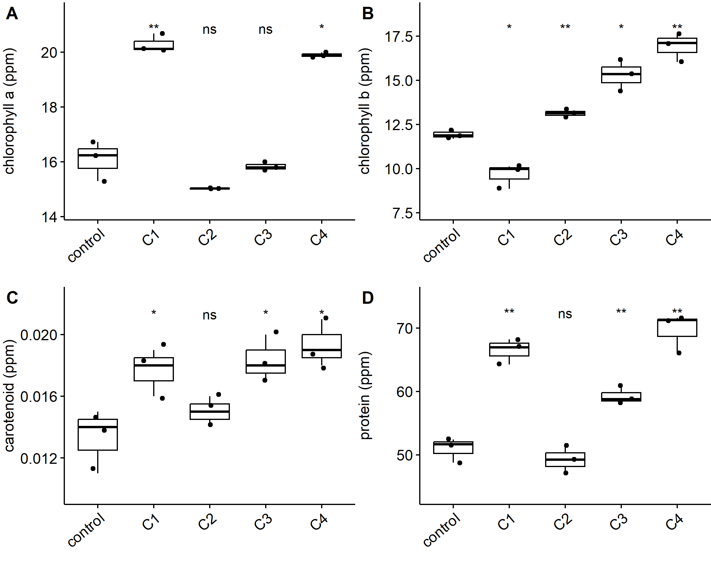

# Weed infestation

``` r
compare_means(total_weed_density~treatments,data = weed_infestation,
              method = "anova")
#> # A tibble: 1 × 6
#>   .y.                       p    p.adj p.format p.signif method
#>   <chr>                 <dbl>    <dbl> <chr>    <chr>    <chr> 
#> 1 total_weed_density 3.63e-15 3.60e-15 3.6e-15  ****     Anova

compare_means(no_of_native_weeds~treatments,data = weed_infestation,
              method = "anova")
#> # A tibble: 1 × 6
#>   .y.                           p       p.adj p.format p.signif method
#>   <chr>                     <dbl>       <dbl> <chr>    <chr>    <chr> 
#> 1 no_of_native_weeds 0.0000000965 0.000000097 9.7e-08  ****     Anova

compare_means(shoot_length~treatments,data = weed_infestation,
              method = "anova")
#> # A tibble: 1 × 6
#>   .y.                 p   p.adj p.format p.signif method
#>   <chr>           <dbl>   <dbl> <chr>    <chr>    <chr> 
#> 1 shoot_length 0.000334 0.00033 0.00033  ***      Anova

compare_means(SPAD_value~treatments,data = weed_infestation,
              method = "anova")
#> # A tibble: 1 × 6
#>   .y.              p  p.adj p.format p.signif method
#>   <chr>        <dbl>  <dbl> <chr>    <chr>    <chr> 
#> 1 SPAD_value 0.00106 0.0011 0.0011   **       Anova

compare_means(grain_yield~treatments,data = weed_infestation,
              method = "anova")
#> # A tibble: 1 × 6
#>   .y.                p    p.adj p.format p.signif method
#>   <chr>          <dbl>    <dbl> <chr>    <chr>    <chr> 
#> 1 grain_yield 6.42e-13 6.40e-13 6.4e-13  ****     Anova

compare_means(straw_yield~treatments,data = weed_infestation,
              method = "anova")
#> # A tibble: 1 × 6
#>   .y.               p  p.adj p.format p.signif method
#>   <chr>         <dbl>  <dbl> <chr>    <chr>    <chr> 
#> 1 straw_yield 0.00535 0.0053 0.0053   **       Anova

compare_means(photosynthetic_rate~treatments,data = weed_infestation,
              method = "anova")
#> # A tibble: 1 × 6
#>   .y.                        p   p.adj p.format p.signif method
#>   <chr>                  <dbl>   <dbl> <chr>    <chr>    <chr> 
#> 1 photosynthetic_rate 0.000230 0.00023 0.00023  ***      Anova

compare_means(transpiration_rate~treatments,data = weed_infestation,
              method = "anova")
#> # A tibble: 1 × 6
#>   .y.                       p   p.adj p.format p.signif method
#>   <chr>                 <dbl>   <dbl> <chr>    <chr>    <chr> 
#> 1 transpiration_rate 0.000144 0.00014 0.00014  ***      Anova

compare_means(stomatal_conductance~treatments,data =weed_infestation,
              method = "anova")
#> # A tibble: 1 × 6
#>   .y.                          p    p.adj p.format p.signif method
#>   <chr>                    <dbl>    <dbl> <chr>    <chr>    <chr> 
#> 1 stomatal_conductance 0.0000187 0.000019 1.9e-05  ****     Anova
```

In subsequent comparisons, we aimed to analysis whether the presence of
C4 can enhance the ability to a herbicide Axial.

> Axial is a brand name of a herbicide produced by the company BASF. The
> active ingredient in Axial is pinoxaden, which is a selective
> herbicide used to control grass weeds in a variety of crops, including
> cereals, rice, and grass seed crops. Axial works by inhibiting the
> growth of the targeted grass weeds, which eventually leads to their
> death. It is typically applied to crops as a post-emergence herbicide,
> meaning it is sprayed directly onto the weeds after they have emerged
> from the soil. As with all herbicides, it is important to follow the
> label instructions carefully and use Axial only as directed to ensure
> effective control of weeds and to minimize any potential risks to
> humans, animals, and the environment.

Before start, we edited the treatments and added a new column `has_c4`
in this data frame. The reason to do this is that we know that the using
of herbicide and C4 can suppress weed growth significantly. Now that the
question is whether C4 can play an important role.

``` r
weed_infestation %<>% 
  mutate(has_c4 = as_factor(if_else(str_detect(treatments, "c4"), "with C4", "without C4"))) %>% 
  mutate(treatments = factor(
    treatments,
    levels = c("weedy control", 
               "wheat+weed 100% axial control", 
               "wheat+weed 100% axial control+c4 inoculation", 
               "wheat+weed 75% axial control", 
               "wheat+weed  75% axial control+c4 inoculation", 
               "wheat+weed 50% axial control", 
               "wheat+weed 50% axial control+c4 inoculation", 
               "wheat+weed 25% axial control", 
               "wheat+weed 25% axial control+c4 inoculation"),
    labels = c("wild", 
               "100% Axial", 
               "100% Axial", 
               "75% Axial", 
               "75% Axial",
               "50% Axial", 
               "50% Axial", 
               "25% Axial", 
               "25% Axial")))
```

**Question**:

-   Is the grain yield in this data frame from weed or wheat?

``` r
cols <- setdiff(names(weed_infestation),c('treatments',"has_c4"))

y_labels <- c("weed density m-2",
              "no of weeds (%)", 
              "shoot length (cm)",
              "SPAD value",
              "grain yield (t ha-1)",
              "straw yield (t ha-1)",
              "photosynthetic rate (µmol m-2 s-1) ",
              "transpiration rate (µmol m-2 s-1)",
              "stomatal conductance (mmol m-2 s-1)")

my_plots = Map(function(x, y) {
  ggboxplot(data = weed_infestation, x = "treatments", y = x,
            legend ="none",
            color = "has_c4",
            ylab = y, xlab = "treatments",
            bxp.errorbar = FALSE,
            bxp.errorbar.width = 0.4,
            palette = "npg",
            notch = FALSE,
            add = "jitter",
            repel = TRUE)+
    stat_compare_means(aes(group = has_c4),
                       label = "p.signif", 
                       method = "t.test")+
    theme(legend.position = "top",
          legend.text = element_text(face = "italic"),
          legend.title = element_blank(),
          axis.text.x = element_text(angle = 30, hjust = 1,vjust = 1)) +
    scale_y_continuous(expand = expansion(0.1, 0))

}, cols, y_labels)
```

## Weed growth

In this figure, why using 25% or 50% Axial have less total weed density
when compare with 75% or 100% Axial? Similar results were also found in
B and C.

``` r
cowplot::plot_grid(plotlist = my_plots[c(1,3,5)],
                   labels = "AUTO",
                   ncol = 2)
```

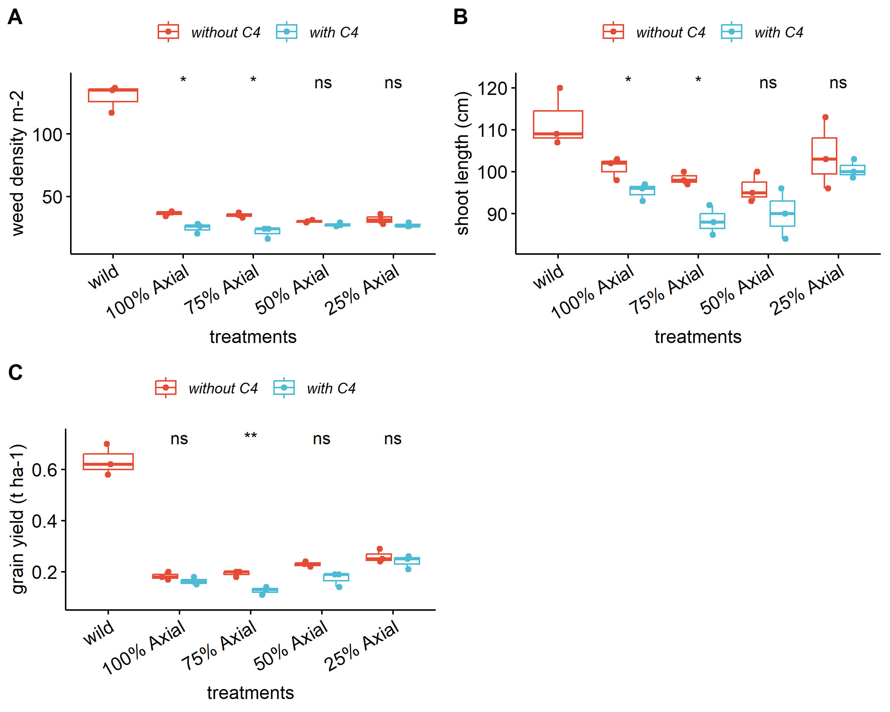

## Weed bioactivity (respiration and photosynthesis)

Are these parameters come from weed plant?

``` r
cowplot::plot_grid(plotlist = my_plots[c(4,6:9)],
                   labels = "AUTO")
```

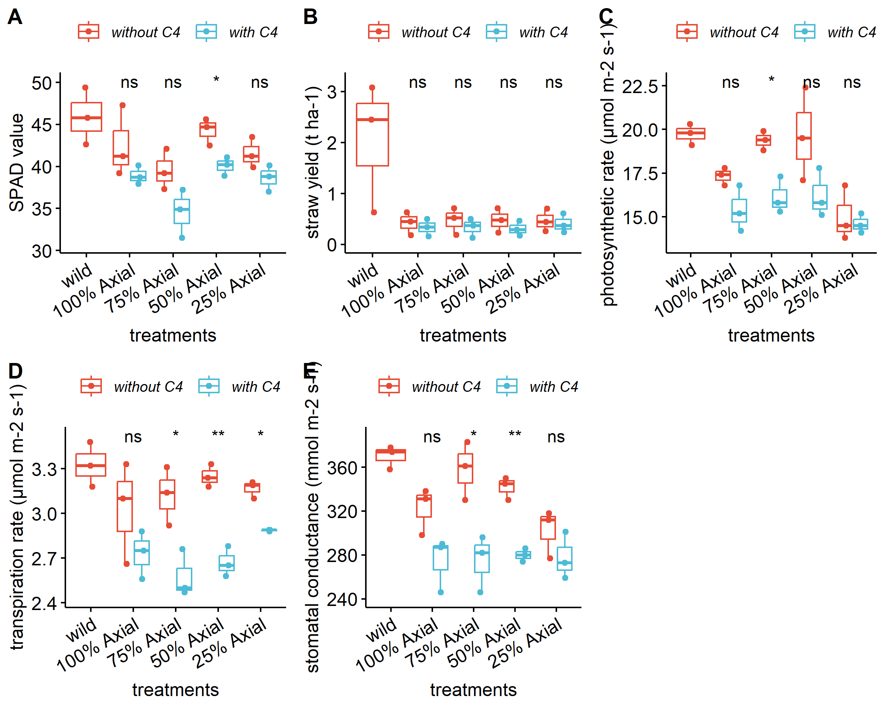

# The growth of wheat infested by weed

Could you explain the setting of weed free control in this data frame?

``` r
infested_wheat
#> # A tibble: 27 × 10
#>    treatments    shoot_length SPAD_value no_of_tillers_per_pl…¹ biological_yield
#>    <chr>                <dbl>      <dbl>                  <dbl>            <dbl>
#>  1 weed free co…          110       48.2                     14             9.95
#>  2 weed free co…          115       43.7                     13            10.0 
#>  3 weed free co…          126       43.7                     12            10.2 
#>  4 wheat+weed 1…          100       38.4                     11             8.23
#>  5 wheat+weed 1…           96       40.2                     10             8.12
#>  6 wheat+weed 1…           94       39.2                     11             8.16
#>  7 wheat+weed 1…          100       44.3                     11             9.09
#>  8 wheat+weed 1…          109       44.1                     12             9.08
#>  9 wheat+weed 1…          108       42.8                     13             9.32
#> 10 wheat+weed 7…           98       38.1                      8             8.32
#> # ℹ 17 more rows
#> # ℹ abbreviated name: ¹​no_of_tillers_per_plant
#> # ℹ 5 more variables: grain_yield <dbl>, straw_yield <dbl>,
#> #   photosynthetic_rate <dbl>, transpiration_rate <dbl>,
#> #   stomatal_conductance <dbl>
```

## ANOVA analysis

``` r
compare_means(shoot_length~treatments,data = infested_wheat,method = "anova")
#> # A tibble: 1 × 6
#>   .y.                 p   p.adj p.format p.signif method
#>   <chr>           <dbl>   <dbl> <chr>    <chr>    <chr> 
#> 1 shoot_length 0.000108 0.00011 0.00011  ***      Anova
compare_means(SPAD_value~treatments,data = infested_wheat,method = "anova")
#> # A tibble: 1 × 6
#>   .y.                p    p.adj p.format p.signif method
#>   <chr>          <dbl>    <dbl> <chr>    <chr>    <chr> 
#> 1 SPAD_value 0.0000430 0.000043 4.3e-05  ****     Anova
compare_means(no_of_tillers_per_plant~treatments,data = infested_wheat,method = "anova")
#> # A tibble: 1 × 6
#>   .y.                         p p.adj p.format p.signif method
#>   <chr>                   <dbl> <dbl> <chr>    <chr>    <chr> 
#> 1 no_of_tillers_per_plant 0.138  0.14 0.14     ns       Anova
compare_means(biological_yield~treatments,data = infested_wheat,method = "anova")
#> # A tibble: 1 × 6
#>   .y.                     p   p.adj p.format p.signif method
#>   <chr>               <dbl>   <dbl> <chr>    <chr>    <chr> 
#> 1 biological_yield 7.54e-11 7.5e-11 7.5e-11  ****     Anova
compare_means(grain_yield~treatments,data = infested_wheat,method = "anova")
#> # A tibble: 1 × 6
#>   .y.                   p      p.adj p.format p.signif method
#>   <chr>             <dbl>      <dbl> <chr>    <chr>    <chr> 
#> 1 grain_yield 0.000000114 0.00000011 1.1e-07  ****     Anova
compare_means(straw_yield~treatments,data = infested_wheat,method = "anova")
#> # A tibble: 1 × 6
#>   .y.                   p      p.adj p.format p.signif method
#>   <chr>             <dbl>      <dbl> <chr>    <chr>    <chr> 
#> 1 straw_yield 0.000000147 0.00000015 1.5e-07  ****     Anova
compare_means(photosynthetic_rate~treatments,data = infested_wheat,method = "anova")
#> # A tibble: 1 × 6
#>   .y.                           p      p.adj p.format p.signif method
#>   <chr>                     <dbl>      <dbl> <chr>    <chr>    <chr> 
#> 1 photosynthetic_rate 0.000000490 0.00000049 4.9e-07  ****     Anova
compare_means(transpiration_rate~treatments,data = infested_wheat,method = "anova")
#> # A tibble: 1 × 6
#>   .y.                         p     p.adj p.format p.signif method
#>   <chr>                   <dbl>     <dbl> <chr>    <chr>    <chr> 
#> 1 transpiration_rate 0.00000117 0.0000012 1.2e-06  ****     Anova
compare_means(stomatal_conductance~treatments,data = infested_wheat,method = "anova")
#> # A tibble: 1 × 6
#>   .y.                             p       p.adj p.format p.signif method
#>   <chr>                       <dbl>       <dbl> <chr>    <chr>    <chr> 
#> 1 stomatal_conductance 0.0000000731 0.000000073 7.3e-08  ****     Anova
```

Simplifying the group names.

``` r
infested_wheat %<>% 
  mutate(has_c4 = as_factor(if_else(str_detect(treatments, "c4"), "with C4", "without C4")),
         .before = 2) %>% 
  mutate(treatments = factor(
    treatments,
    levels = c("weed free control", 
               "wheat+weed 100% axial control", 
               "wheat+weed 100% axial control+c4 inoculation", 
               "wheat+weed 75% axial control", 
               "wheat+weed  75% axial control+c4 inoculation", 
               "wheat+weed 50% axial control", 
               "wheat+weed 50% axial control+c4 inoculation", 
               "wheat+weed 25% axial control", 
               "wheat+weed 25% axial control+c4 inoculation"),
    labels = c("weed-free", 
               "100% Axial", 
               "100% Axial", 
               "75% Axial", 
               "75% Axial",
               "50% Axial", 
               "50% Axial", 
               "25% Axial", 
               "25% Axial")))
infested_wheat
#> # A tibble: 27 × 11
#>    treatments has_c4     shoot_length SPAD_value no_of_tillers_per_plant
#>    <fct>      <fct>             <dbl>      <dbl>                   <dbl>
#>  1 weed-free  without C4          110       48.2                      14
#>  2 weed-free  without C4          115       43.7                      13
#>  3 weed-free  without C4          126       43.7                      12
#>  4 100% Axial without C4          100       38.4                      11
#>  5 100% Axial without C4           96       40.2                      10
#>  6 100% Axial without C4           94       39.2                      11
#>  7 100% Axial with C4             100       44.3                      11
#>  8 100% Axial with C4             109       44.1                      12
#>  9 100% Axial with C4             108       42.8                      13
#> 10 75% Axial  without C4           98       38.1                       8
#> # ℹ 17 more rows
#> # ℹ 6 more variables: biological_yield <dbl>, grain_yield <dbl>,
#> #   straw_yield <dbl>, photosynthetic_rate <dbl>, transpiration_rate <dbl>,
#> #   stomatal_conductance <dbl>
```

``` r
cols <- setdiff(names(infested_wheat),c('treatments',"has_c4"))
y_labels <- c("shoot length (cm)",
              "SPAD value", 
              "no of tillers  plant-1",
              "biological yield",
              "grain yield (t ha-1)",
              "straw yield (t ha-1)",
              "photosynthetic rate (µmol m-2 s-1) ",
              "transpiration rate (µmol m-2 s-1)",
              "stomatal conductance (mmol m-2 s-1)")


Map(function(col_name, y_label) {
  ypos = infested_wheat %>% 
    group_by(treatments) %>% 
    summarise(yposition = max(get(col_name)) * 1.01)
  stat_by_group = compare_means(as.formula(paste(col_name, "~ has_c4")), 
                       data = infested_wheat, 
                       method = "t.test", 
                       group.by = "treatments") %>% 
    mutate(xpos = as.numeric(get("treatments"))) %>% 
    mutate(xmin = xpos - 0.2,
           xmax = xpos + 0.2) %>% 
    # filter(p < 0.05) %>% 
    left_join(ypos)
  ggboxplot(data = infested_wheat, 
            x = "treatments", 
            y = col_name,
            ylab = y_label, 
            xlab = "treatments",
            color = "has_c4",
            bxp.errorbar = FALSE,
            bxp.errorbar.width = 0.4,
            notch = FALSE,
            palette = "npg",
            add = "jitter") +
    geom_signif(xmin = stat_by_group$xmin, xmax = stat_by_group$xmax, 
                annotation = stat_by_group$p.signif,
                y_position = stat_by_group$yposition,
                tip_length = 0) +
    theme(legend.position = "top",
          legend.text = element_text(face = "italic"),
          legend.title = element_blank(),
          axis.text.x = element_text(angle = 30, hjust = 1,vjust = 1)) +
    scale_y_continuous(expand = expansion(0.1, 0))

}, cols, y_labels) -> list_of_plots
```

## Wheat growth

Firstly, similar questions can be raised as I did in discussing the
weed_infestation results. On this basis, the conclusions are:

-   The application of herbicide also have significant suppressing
    effect on wheat growth;
-   The addition of C4 SynComs neutralize such a toxic effect.
-   75% of Axial and C4 has the best performance in maintaining wheat
    growth. In such condition, all the four parameters showed in this
    figure are comparable to the weed-free control.

``` r
cowplot::plot_grid(plotlist = list_of_plots[c(1,4:6)],
                   labels = "AUTO",
                   ncol = 2)
```

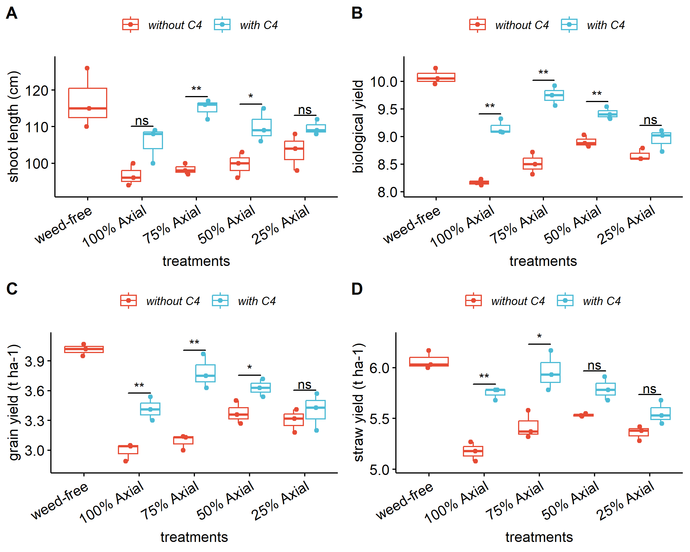

## Wheat bioactivity

``` r
cowplot::plot_grid(plotlist = list_of_plots[c(2,7:9)],
                   labels = "AUTO",
                   ncol = 2)
```

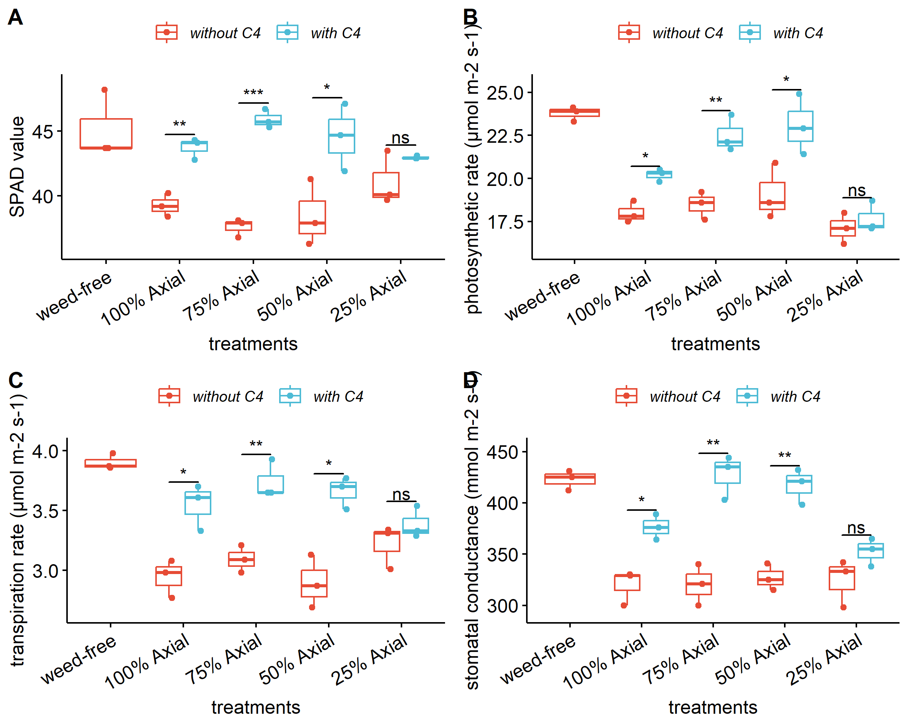

# Conclusion

The main questions of this study are:

1.  Whether we can use the combination of herbicide and SynComs to
    achieve environment-friendly weed control?
2.  If yes, how could we find the best solution, i. e. the recipe for
    the best? The best solution has its application value. It can be
    directly used to improve agricultural production.

From the data showed on the above, we now can found:

1.  Yes, we can achieve a better control of weed in wheat field with
    both herbicide and bacteria communities. The addition of bacteria
    community can not only enhance the suppression effect of herbicide,
    but also promote the growth of wheat.

2.  While combining the herbicide and bacteria community, using 75% or
    50% dose of Axial and C4 is sufficient in inhibiting weed growth.
